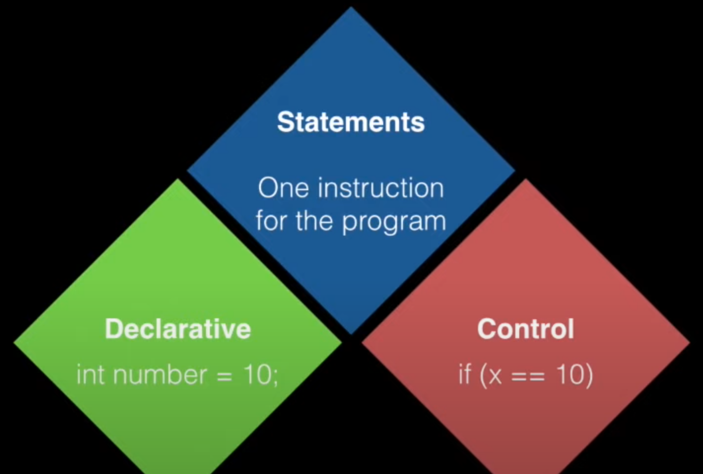
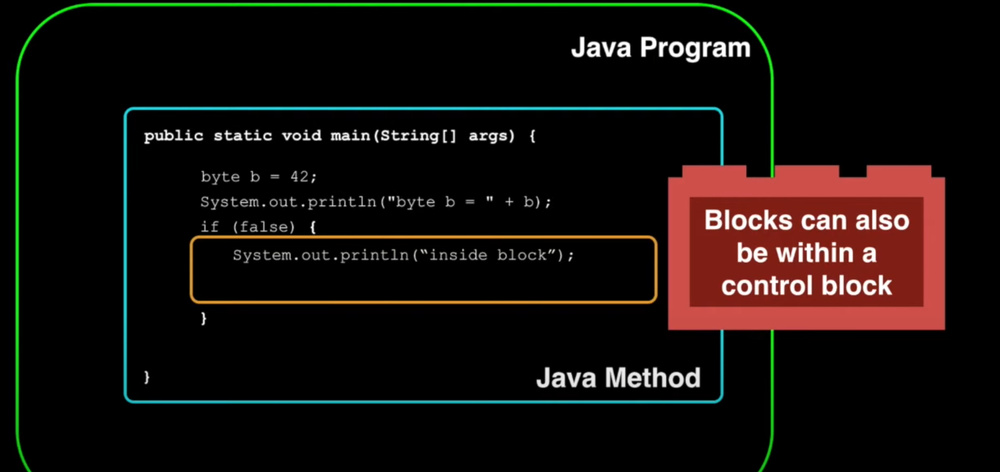

 

 ---

 

<!--
Empty block is also valid!
-->

---

## Separation of Concern

<!--

Demo statements and blocks
Variable outside block, variable inside block
Call outside var in inner block, works
Call outside var after block, works
Call inside var in block, works
Call intside var, outside block, works

Extend block out to other method, can't access vars
How do we get it there?

Start separating print from logic - this is commonly done
How do we get value out of method?

-->